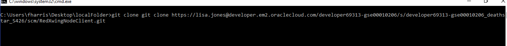

## USING GIT WITH THE COMMAND LINE ##

If you are going to use git command line to import the code, and if you decide to not use an IDE such as Eclipse with a compiler and maven ready to use, you should need to install your own Maven running in your machine in order to compile and package the code.

So, let's start by locally clone the code you need. At this point you should already have copied the URL for the git remote repository you'll be cloning....

Create a local folder in your machine. From inside that folder run git clone :

After changing a file....

