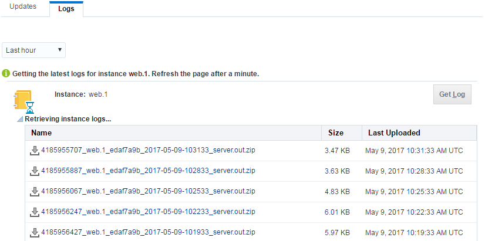

## Accessing log data

Logs can be used to view issues and/or information about the deployment/running status of the application in Application Container Cloud and give insight into errors on deployment or can serve debugging purposes.
To retrieve the logs go into [Application Container Cloud](https://apaas.europe.oraclecloud.com/apaas/faces/aPaaSRunner.jspx) and select your application. Click on the Administration tab as shown in the image below.

Now select the Logs tabs and click the get logs button. A list of logs shows up. Clicking on any of them downloads the file.

