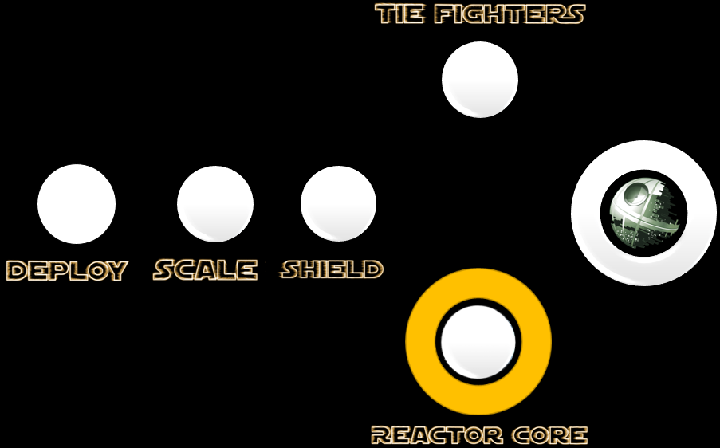

## Mission 4. Destroy the Reactor Core! ##



### Mission Description ###


The spy should now have exposed the secrets of the database where the Death Star stores the coordinates to it's Reactor Core! When our spy returns with the information, find out the coordinates and attack it with your fighter! 

### Mission Awards ###

- Maximum number of points for this mission: **500**
- Lesser points will be given to subsequent squads.

### Mission Instructions ###

1. You should now have recieved information from the spy about the credentials to the Death Star MySQL database where the coordinates for the Core Reactor is kept. Develop a MySQL query that queries the **MissionDatabase** table to retrieve information about the Reactor Core coordinates!

2. When you have the coordinates, hit the Reactor Core at the following URL:
```https://140.86.35.229:3000/reactorCore/x-coordinate_goes_here/y-coordinate_goes_here/Your_squad_name_goes_here(e.g yellow)/Your_microservice_name_goes_here(e.g YellowXWingNode)```. 
**The Reactor Core will get hit by HTTP GET Request bullets!**

3. Deploy a new version of your microservice either by using [Continous Integration and Deployment](../deployment/cicd.md) or the [manual](../deployment/manually.md) approach. 

4. When your updated microservice is live, it will hopefully hit the Death Star's Reactor Core!

5. If you feel that your microservice is not behaving correctly or might not have been deployed correctly, have a look at the logs as described [here](../logs.md). If you are using the Continuous Integration and Deployment strategy, explore the status of your build in Developer Cloud as described [here](../devcs.md)

### Next: End ###

If you haven't already completed the TIE Fighters mission you can do that [here](iterate.md). If you have, you can continue on to the last mission - [Hacking the Fuel Tank](fuelTank.md)


