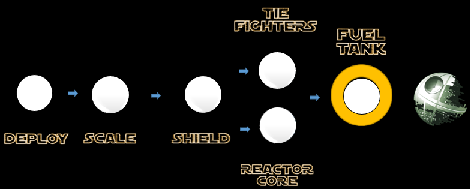

## Mission 6. Hack the Fuel Tank! ##

### Mission Description ###

If we are lucky, our spy has found a decrypted password that can be used to remotely control the Fuel Tank of the Death Star.
If we manage to decrypt the password, we should be able to access the control panel and destroy the Fuel Tank!

### Mission Awards ###

- Maximum number of points for this mission: **1000**
- Lesser points will be given to subsequent squads.

### Mission Instructions ###

1. Wait until our spy has found the decrypted password! The pass

2. Try to decrypt the password 

3. Deploy a new version of your microservice either by using [Continous Integration and Deployment](../deployment/cicd.md) or the [manual](../deployment/manually.md) approach. 

4. When your updated microservice is live, it will hopefully hit the Death Star's Reactor Core!

5. If you feel that your microservice is not behaving correctly or might not have been deployed correctly, have a look at the logs as described [here](../logs.md). If you are using the Continuous Integration and Deployment strategy, explore the status of your build in Developer Cloud as described [here](../devcs.md)

### Next: End ###

If you haven't already completed the TIE Fighters mission you can do that [here](iterate.md). If you have, your missions are completed! Congratulations!

