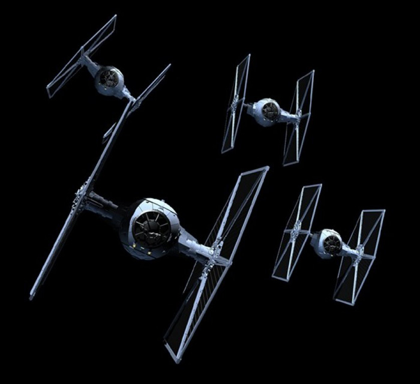

## Mission: Shoot down the Mini Fighters ##

### Mission Description ###


The Alien War Ship has sent out 10 Mini Fighters to attack your fighters! You need to take them down as soon as possible. The mission is completed when a squad has shot down all the Mini Fighters.

### Mission Awards ###

- Maximum number of points for this mission: **500**
- Lesser points will be given to subsequent squads.

### Mission Instructions ###

1. You should now have received information from the spy that will give you the y-coordinates of the Mini Fighters. The example below would shoot down ***one*** of the Mini Fighters. ***The x-coordinate is locked at coordinate 45***.

<!--
+ Note to instructor: Edit this page with the correct IP address and port in the URL.
-->

```REPLACE_WITH_IP:3000/fighters/45/y-coordinate_goes_here/Your_squad_name_goes_here(e.g yellow)/Your_microservice_name_goes_here(e.g YellowJava2Fighter)```. **The Mini Fighters will get hit by HTTP GET Request bullets!**

2. Deploy a new version of your microservice either by using [Continuous Integration and Deployment](../deployment/cicd.md) or the [manual](../deployment/manually.md) approach.

3. When your updated microservice is live, it will hopefully hit the Mini Fighters sent out by the Alien War Ship!

4. If you feel that your microservice is not behaving correctly or might not have been deployed correctly, have a look at the logs as described [here](../logs.md). If you are using the Continuous Integration and Deployment strategy, explore the status of your build in Developer Cloud as described [here](../devcs.md)

### Next: End ###
<!-- and without jargon in this [Technograph article](http://www.dailyillini.com/article/2016/04/automatic-speech-recognition).
If you haven't already completed the Reactor Core mission you can do that [here](database.md). If you have, you can continue on to the last mission - [Hacking the Fuel Tank](fuelTank.md)
-->
Congratulations! You are done!
