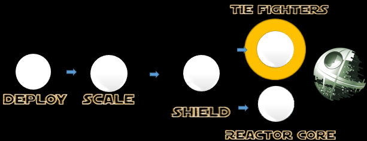

## Mission 5. Shoot down the TIE Fighters ##



### Mission Description ###


The Death Star has sent out 10 TIE Fighters to attack your fighters! You need to take them down as soon as possible. The mission is completed when a squad has shot down all the TIE Fighters. 

### Mission Awards ###

- Maximum number of points for this mission: **500**
- Lesser points will be given to subsequent squads.

### Mission Instructions ###

1. You should now have recieved information from the spy that will give you the y-coordinates of the TIE Fighters. The example below would shoot down ***one*** of the TIE Fighters. ***The x-coordinate is locked at coordinate 45***.

```https://ds-backend-gse00010206.apaas.em2.oraclecloud.com/fighters/45/y-coordinate_goes_here/Your_squad_name_goes_here(e.g yellow)/Your_microservice_name_goes_here(e.g YellowXWingNode)```. **The TIE Fighters will get hit by HTTP GET Request bullets!**

2. Deploy a new version of your microservice either by using [Continous Integration and Deployment](deployment/cicd.md) or the [manual](deployment/manually.md) approach. 

3. When your updated microservice is live, it will hopefully hit the TIE Fighters sent out by the Death Star!

4. If you feel that your microservice is not behaving correctly or might not have been deployed correctly, have a look at the logs as described [here](../logs.md). If you are using the Continuous Integration and Deployment strategy, explore the status of your build in Developer Cloud as described [here](../devcs.md)

### Next: End ###

If you haven't already completed the Reactor Core mission you can do that [here](database.md). If you have, your missions are completed! Congratulations!


