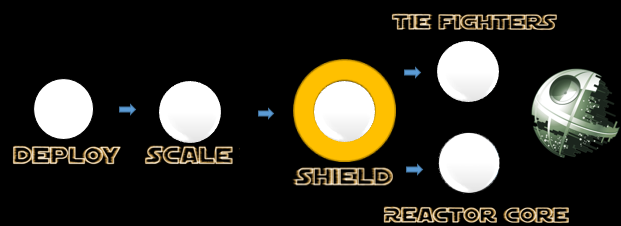

## Mission 3. Take down the shield! ##



### Mission Description ###

Your squad is ready and it should now have one or more microservices with at least one of them having 2 instances.

The Death Star is protected by it's powerful shield. As long as we can't break through the shield, we will have a hard time hitting the core reactors of the Death Star.
To start firing at the shield, we first need to have the Death Star exposing it's coordinates. Keep an eye out on what our spy is saying. It should be in the SPY section of the Dashboard.

### Mission Awards ###

- Maximum number of points for this mission: **300**
- Lesser points will be given to subsequent squads.

### Mission Instructions ###

1. Make sure that our spy has reported some more information about the coordinates of the shield. If not, you have to wait a bit!

2. We now need to fire at the coordinates of the shield! Use your selected weapon to implement a function that fires against the shield. The base URL of the shield is ```https://140.86.35.229:3000/shield/x-coordinate_goes_here/y-coordinate_goes_here/Your_squad_name_goes_here(e.g yellow)/Your_microservice_name_goes_here(e.g YellowXWingNode)```. **The shield will get hit by HTTP GET Request bullets!**

3. Deploy a new version of your microservice either by using [Continous Integration and Deployment](../deployment/cicd.md) or the [manual](../deployment/manually.md) approach. 

4. When your updated microservice is live, it will hopefully hit the Death Star's shield!

5. If you feel that your microservice is not behaving correctly or might not have been deployed correctly, have a look at the logs as described [here](../logs.md). If you are using the Continuous Integration and Deployment strategy, explore the status of your build in Developer Cloud as described [here](../devcs.md)

### Next: Fourth Mission ###

The Death Star is getting weaker! Let's start attacking it more. [Click here](iterate.md) to continue!


